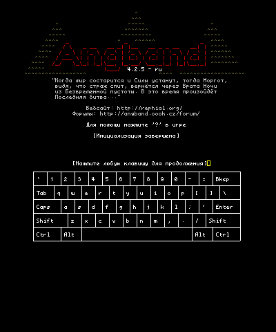
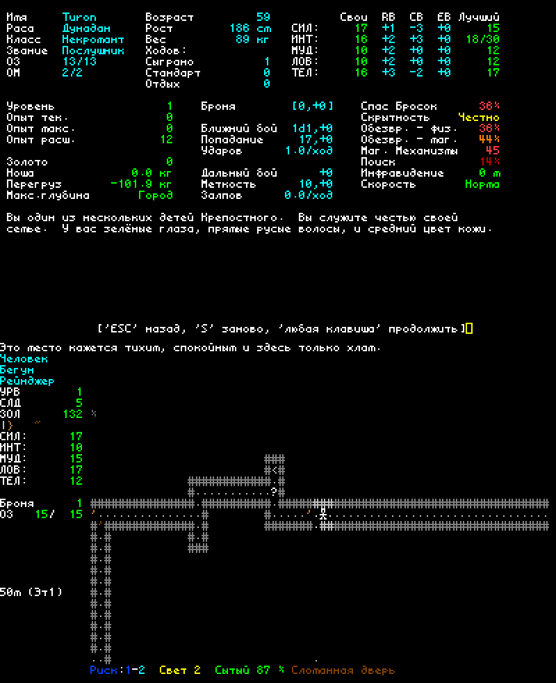

# Angband 4.2.5 - ru

Русская локализация последней ванильной версии игры.

Теперь русский язык доступен и для Nintendo 3DS. 

В процессе... попытка номер Два

**Если кто-то захочет помочь с переводом файла lib\gamedata\monster.txt - пишите здесь или pav13@mail.ru**

  
  

Angband - это графическая игра о приключениях в подземелье, в которой 
используются текстовые символы для стен и пола подземелий, а также 
его обитателей, в духе таких игр, как NetHack и Rogue.  Если вам нужна 
помощь в игре, нажмите `?`.

- **Установка Ангбанда:** See the [Official Website](https://angband.github.io/angband/) или [compile it yourself](https://angband.readthedocs.io/en/latest/hacking/compiling.html).
- **Как играть:** [The Angband Manual](https://angband.readthedocs.io/en/latest/)
- **Получить помощь:** [Angband Forums](https://angband.live/forums/)

Наслаждайтесь!

-- Команда разработчиков Angband
