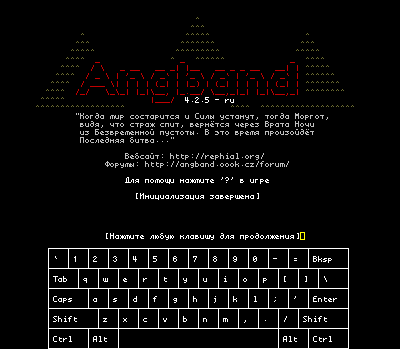
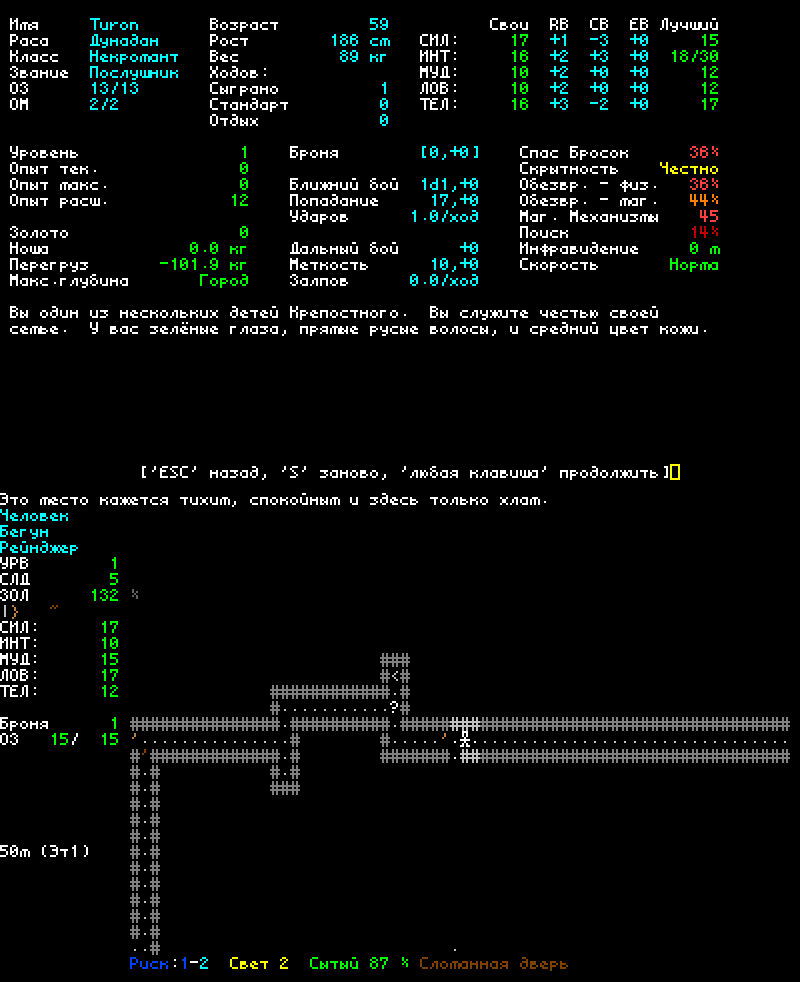

# Angband 4.2.5

Русская локализация от pav13.
Теперь русский язык доступен и для Nintendo 3DS. 

В процессе...

  
  
  

Angband - это графическая игра о приключениях в подземелье, в которой 
используются текстовые символы для стен и пола подземелий, а также 
его обитателей, в духе таких игр, как NetHack и Rogue.  Если вам нужна 
помощь в игре, нажмите `?`.

- **Установка Ангбанда:** Смотрите [Официальный веб-сайт](https://angband.github.io/angband/) или [скомпилируйте это сами](https://angband.readthedocs.io/en/latest/hacking/compiling.html).
- **Как играть:** [Руководство Angband](https://angband.readthedocs.io/en/latest/)
- **Получить помощь:** [Angband Форум](http://angband.oook.cz/forum/)

Наслаждайтесь!

-- Команда разработчиков Angband
